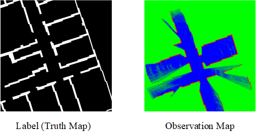

# SenseMapDataset
2025-4-1: Accepted by IJCNN 2025
## Introduction

    

The dataset is designed for local 2D map prediction and contains 23049 data samples, each map saved in PNG format. All pictures were produced through a simulation platform based on [HouseExpo](https://github.com/TeaganLi/HouseExpo) modifications and the [KTH dataset](http://www.csc.kth.se/~aydemir/KTH_CampusValhallavagen_Floorplan_Dataset.tar.bz2). The local observation map is a 640x640 pixel three-channel color image. The value of each pixel is 255 or 0, and the meaning of each pixel value is as follows: blue 255 represents free space, green 255 represents uncertain space, and red 255 represents obstacles. The local ground truth map is a single-channel 640 × 640 pixel grayscale image, where pixel values are also limited to 255 and 0. In these maps, 255 represents obstacles and 0 represents free space.

Distribution of the three channels in the local observation map (in pixels)

| Category |  Mean  |  Max  |  Min  |  Std  |  Var  |
| -------- | ------ | ----- | ----- | ----- | ----- |
| Free     | 107041.81 | 226004.00 | 41082.00 | 28878.11 | 833945433.75 |
| Uncertain | 296115.86 | 363392.00 | 173873.00 | 29356.15 | 861784000.00 |
| Obstacle | 6442.32 | 11504.00 | 5120.00 | 1046.59 | 1095351.46 |

Distribution of the feature values in the ground truth map (in pixels)

| Category |  Mean  |  Max  |  Min  |  Std  |  Var  |
| -------- | ------ | ----- | ----- | ----- | ----- |
| Free     | 317179.25 | 401229.00 | 119897.00 | 51082.56 | 2609427612.08 |
| Uncertain | 92420.75 | 289703 | 8371.00 | 51082.56 | 2609427612.08 |
| Radio(free/obstacle) | 4.97 | 47.93 | 0.41 | 3.46 | 11.98 |

Coverage of the local observation map on the local ground truth map (coverage of the free pixels in the local observation map/ground truth map)

| Category |  Mean  |  Max  |  Min  |  Std  |  Var  |
| -------- | ------ | ----- | ----- | ----- | ----- |
| Coverage | 0.34 | 0.94 | 0.11 | 0.10 | 0.01|

## Download
The dataset download method will be announced after the paper is published.

## Contact
If you have any questions, please feel free to contact: 

Haojia Gao [gaohaojia@emails.bjut.edu.cn](mailto:gaohaojia@emails.bjut.edu.cn), Haohua Que [haohuaque@outlook.com](mailto:haohuaque@outlook.com), Fei Qiao [qiaofei@tsinghua.edu.cn](mailto:qiaofei@tsinghua.edu.cn)